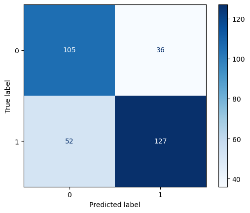

# Wine Quality Project

## 1. Introduction

This is a set with the compilation of several chemicals parameters related with the wine quality. We are going to use this dataset to predict if the wine is a good quality wine or not, using parameters like: 
1- Fixed acidity 
2- Volatile acidity 
3- Citric acid concentration 
4- Residual sugar 
5- Amount of chlorides 
6- Total amount of sulfur dioxide 
7- Solution density 
8- Solution pH 
9- Amont of sulphates 
10- Alcohol grade 

## 2. Data cleanning and preparation 

The first thing that we checked in the dataset was if there was any missing or nan values present inside the data: 

  

<strong>Figure 1.</strong> Every Nan values in the dataset

There wasn't nan values present in the dataset. After this we explore the data, to see if all the values were in a logical range:

  

<strong>Figure 2.</strong> Dataset column's histograms

There wasn't any anomaly present in the features or the output classes in the dataset. 

We are addressing a classification problem, the desired output labels are bad quality wine that will be represented with a 0 value and good quality wine 
that will be represented with a 1 value. Input features had different scales: 
1- Fixed acidity: <strong> 0<x<16 </strong>

2- Volatile acidity: <strong> 0<x<1.6 </strong>

3- Citric acid concentration: <strong> 0<x<1 </strong>
 
4- Residual sugar: <strong> 0<x<16 </strong>

5- Amount of chlorides: <strong> 0<x<0.6 </strong>

6- Total amount of sulfur dioxide: <strong> 0<x<75 </strong>

7- Solution density: <strong> 0<x<300 </strong>

8- Solution pH: <strong> 2.6<x<4.2 </strong>

9- Amont of sulphates: <strong> 0.25<x<2 </strong>

10- Alcohol grade: <strong> 8<x<15.2 </strong>

For this reason the features  <strong>[fixed acidity, residual sugar, free sulfur dioxide, total sulfur dioxide, alcohol]</strong> were scaled using min-max normalization, after this the original columns (without scaling) were dropped, because they were not needed for the model training.

## 3. Benchamark model

A <strong>DecisionTreeClassifier</strong> was the model selected to train using the dataset. We import the model from the ML-library sklearn, after this we split the data into training and testing set, we set the size of the testing set using the hyperparameter <strong>test_size=0.2</strong>. The model was trained, accuracy metrics and a confusion matrix were used to determine the model's perfomance. The accuracy of the benchmark model was <strong>accuracy=0.725</strong> and the confusion matrix is presented in the following figure:

  

<strong>Figure 3.</strong> Benchmark Model Performance

The DecisionTreeClassifier performed well in solving this classification problem. However, its performance can be further enhanced through feature engineering and by experimenting with other models that may better fit our data. 