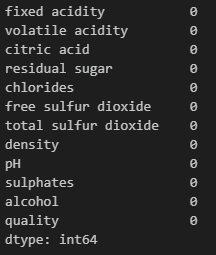
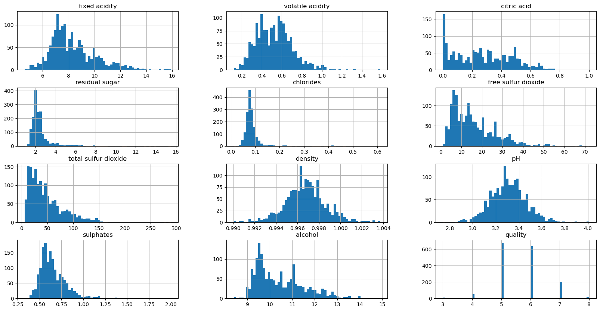

# Wine Quality Project

## 1. Introduction

This is a set with the compilation of several chemicals parameters related with the wine quality. We are going to use this dataset to predict if the wine is a good quality wine or not, using parameters like: 
1- Fixed acidity 
2- Volatile acidity 
3- Citric acid concentration 
4- Residual sugar 
5- Amount of chlorides 
6- Total amount of sulfur dioxide 
7- Solution density 
8- Solution pH 
9- Amont of sulphates 
10- Alcohol grade 

## 2. Data cleanning and preparation 

The first thing that we checked in the dataset was if there was any missing or nan values present inside the data: 

  

<strong>Figure 1.</strong> Every Nan values in the dataset

There wasn't nan values present in the dataset. After this we explore the data, to see if all the values were in a logical range:

  

<strong>Figure 2.</strong> Dataset column's histograms

We are addressing a classification problem, the desired output labels are bad quality wine that will be represented with a 0 value and good quality wine 
that will be represented with a 1 value. Input features had different scales: 
1- Fixed acidity: 
<strong> 0<x<16 </strong>

2- Volatile acidity: 
<strong> 0<x<1.6 </strong>

3- Citric acid concentration: 
<strong> 0<x<1 </strong>
 
4- Residual sugar: 
<strong> 0<x<16 </strong>

5- Amount of chlorides: 
<strong> 0<x<0.6 </strong>

6- Total amount of sulfur dioxide: 
<strong> 0<x<75 </strong>

7- Solution density: 
<strong> 0<x<300 </strong>

8- Solution pH: 
<strong> 2.6<x<4.2 </strong>

9- Amont of sulphates: 
<strong> 0.25<x<2 </strong>

10- Alcohol grade: 
<strong> 8<x<15.2 </strong>
