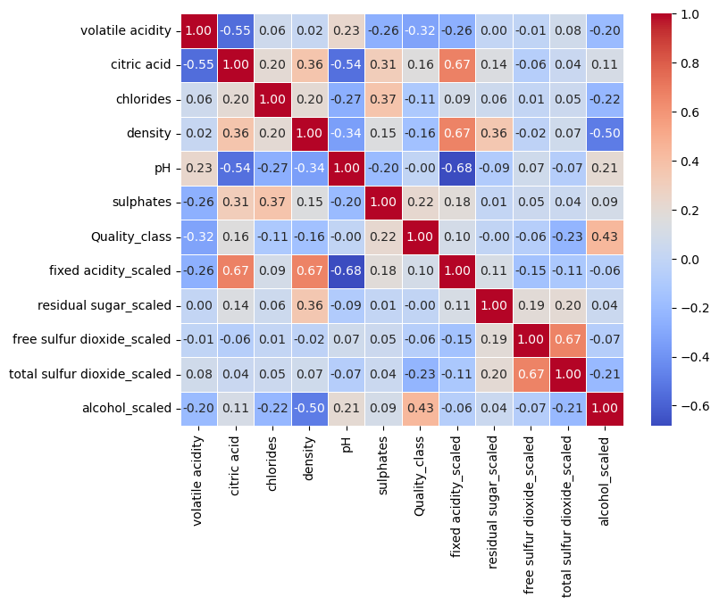

# Wine Quality Project

You can find the dataset:
*https://www.kaggle.com/datasets/uciml/red-wine-quality-cortez-et-al-2009*

## 1. Introduction
<p align="justify">
This is a set with the compilation of several chemicals parameters related with the wine quality. We are going to use this dataset to predict if the wine is a good quality wine or not, using parameters like:
</p>
1- Fixed acidity<br/>
2- Volatile acidity<br/>
3- Citric acid concentration<br/>
4- Residual sugar<br/>
5- Amount of chlorides<br/>
6- Total amount of sulfur dioxide<br/>
7- Solution density<br/>
8- Solution pH<br/>
9- Amont of sulphates<br/>
10- Alcohol grade<br/>

## 2. Data cleanning and preparation 
<p align="justify">
The first thing that we checked in the dataset was if there was any missing or nan values present inside the data:
</p>

<details>
  <summary>Click to see output of the <strong>isna().sum()</strong> </summary>

<div align="center">
  
</div>
<p><strong>Figure 1.</strong> Every Nan values in the dataset

</details>

<p align="justify">
There wasn't nan values present in the dataset as was confirmed by running <strong>isna().sum()</strong>. After this we explore the data, to see if all the values were in a logical range:
</p>

<div align="center">
  
</div>
<p><strong>Figure 2.</strong> Dataset column's histograms

<p align="justify">
There wasn't any anomaly present in the features or the output classes in the dataset.
</p>

<p align="justify">
We are addressing a classification problem, the desired output labels are bad quality wine that will be represented with a 0 value and good quality wine 
that will be represented with a 1 value. Input features had different scales:
</p>

1- Fixed acidity: <strong> 0<x<16 </strong> </br>
2- Volatile acidity: <strong> 0<x<1.6 </strong> </br>
3- Citric acid concentration: <strong> 0<x<1 </strong> </br>
4- Residual sugar: <strong> 0<x<16 </strong> </br>
5- Amount of chlorides: <strong> 0<x<0.6 </strong> </br>
6- Total amount of sulfur dioxide: <strong> 0<x<75 </strong> </br>
7- Solution density: <strong> 0<x<300 </strong> </br>
8- Solution pH: <strong> 2.6<x<4.2 </strong> </br>
9- Amont of sulphates: <strong> 0.25<x<2 </strong> </br>
10- Alcohol grade: <strong> 8<x<15.2 </strong> </br>

<p align="justify">
For this reason the features  <strong>[fixed acidity, residual sugar, free sulfur dioxide, total sulfur dioxide, alcohol]</strong> were scaled using min-max normalization, after this the original columns (without scaling) were dropped, because they were not needed for the model training.
</p>

## 3. Benchamark model

<p align="justify">
A <strong>DecisionTreeClassifier</strong> was the model selected to train using the dataset. We import the model from the ML-library sklearn, after this we split the data into training and testing set, we set the size of the testing set using the hyperparameter <strong>test_size=0.2</strong>. The model was trained, accuracy metrics and a confusion matrix were used to determine the model's perfomance. The accuracy of the benchmark model was <strong>accuracy=0.725</strong> and the confusion matrix is presented in the following figure:
</p>

<div align="center">
  
</div>
<p><strong>Figure 3.</strong> Benchmark Model Performance

<p align="justify">
The DecisionTreeClassifier performed well in solving this classification problem. However, its performance can be further enhanced through feature engineering and by experimenting with other models that may better fit our data. 
</p>

## 4. Feature Engineering

<p align="justify">
A correlation feature matrix was used to analyze the relationship between input features and output classes. A threshold of 0.2 was set, and all features with a correlation above this value with wine quality were selected for retraining the model. 
</p>

<div align="center">
  
</div>
<p><strong>Figure 4.</strong> Correlation Feature Matrix 

<p align="justify">
After this selection process, the input features selected were <strong>[volatile acidity, sulphates, total sulfur dioxide_scaled, alcohol_scaled]</strong>.
</p>

## 5. Model Training 

<p align="justify">
In this section three models were selected to train and compare their perfomance based in <strong>accuracy, precision, recall and f1-score metrics</strong>. The models selected were <strong> Decision Tree, Random Forest and Gradient Boosting </strong>. In the next figure are shown the confusion matrix for these three models:
</p>

<div align="center">
  
</div>
<p><strong>Figure 5.</strong> Confusion Matrices for the three selected models.

<p align="justify">
In <strong>Table 1</strong>, it can be observed that the best-performing model was Random Forest.
</p>

|Metrics   |Decision Tree|Random Forest|Gradient Boosting|
|----------|-------------|-------------|-----------------|
|Accuracy  |0.737500     |0.809375     |0.734375         |
|Precision |0.787879		 |0.847059     |0.770115         |
|Recall    |0.726257		 |0.804469     |0.748603         |
|F1-score  |0.755814		 |0.825215     |0.759207         |

<p><strong>Table 1.</strong> Three models metrics comparision

## 6. Random Forest Hyperparameters Tuning 

<p align="justify">
A grid was made with several hyperparameter of the model and then used the RandomizedSearchCV function inside of sklearn library to found the best set of hyperparameters regarding to accuracy metrics. 
</p>

```python
# Number of trees in the forest
n_estimators = [int(x) for x in np.linspace(start=100, stop=200, num=11)]
# How to compute the quality of split
criterion = ['gini', 'entropy']
# Number of features to consider at every split
max_features = ['sqrt', 'log2']
# Maximum number of levels in tree
max_depth = [2, 4, 8, 10, 12]
max_depth.append(None)
# Minimum number of samples required to split a node
min_samples_split = [2, 4, 8, 16, 32]
# Minimum number of samples required at each leaf node
min_samples_leaf = [1, 2, 4, 10, 20]
# Method of selecting samples for training each tree
bootstrap = [True, False]

random_grid = {'n_estimators': n_estimators,
               'criterion': criterion,
               'max_features': max_features,
               'max_depth': max_depth,
               'min_samples_split': min_samples_split, 
               'min_samples_leaf': min_samples_leaf, 
               'bootstrap': bootstrap
               }

from sklearn.model_selection import RandomizedSearchCV

rf = RandomForestClassifier(random_state=42)

# Random search
random_search = RandomizedSearchCV(rf, param_distributions=random_grid, n_iter=20, cv=5, n_jobs=-1, scoring='accuracy', random_state=42)
random_search.fit(X_train, y_train)

forest_opt = RandomForestClassifier(**random_search.best_params_)

```

|Metrics   |Random Forest optimized|Random Forest|
|----------|-----------------------|-------------|
|Accuracy  |0.790625               |0.809375     |
|Precision |0.829412		           |0.847059     |
|Recall    |0.787709		           |0.804469     |
|F1-score  |0.808023		           |0.825215     |

<p><strong>Table 2.</strong> Optimized and non-optimized hyperparameters Random Forest performance

## 6. Conclusions
 
 <p align="justify">
 The model's performance is already strong even before hyperparameter tuning, and further tuning does not seem to enhance it. However, there are two possible approaches to potentially improve its performance. First, increasing the <strong>n_iter</strong> hyperparameter in the <strong>RandomizedSearchCV</strong> function may help explore a wider range of parameter combinations. Second, using <strong> GridSearchCV </strong>could identify the optimal hyperparameter combination, with the inconvinient that it is computationally more expensive.
</p>

